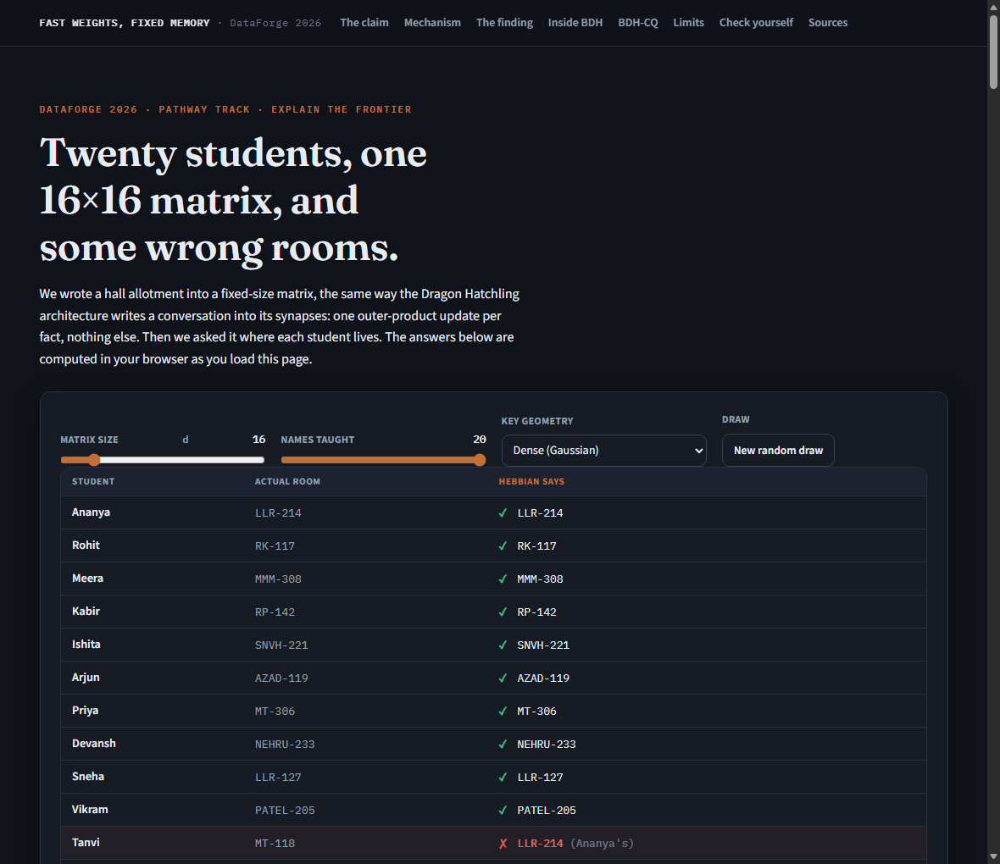

# Fast Weights, Fixed Memory

An interactive explainer for the **DataForge 2026 Pathway track** ("Explain the Frontier").

**Live page:** https://USERNAME.github.io/fast-weights-fixed-memory/ *(GitHub Pages; deploys from `main` via `.github/workflows/pages.yml` — replace `USERNAME` once the repo is pushed)*
**Mirror:** https://claude.ai/code/artifact/394c8c5a-8fe6-4a60-a136-c9ba087ad747
**One-page concept summary:** [`docs/one-pager.pdf`](docs/one-pager.pdf)



We wrote a hall allotment into a fixed-size matrix using BDH's synaptic update rule, then
asked it where each student lives. It gets some of them wrong, and it gets them wrong in a
specific and informative way: it hands back another student's real room, confidently. From
there the page works out why, what three different published architectures do about it, and
which of them is actually better (the answer is "at what?").

```
git clone <this repo> && cd fast-weights-fixed-memory
npm start          # http://localhost:4173 — no install step, there are no dependencies
npm test           # 37 assertions over the memory maths
npm run experiments  # regenerates every number quoted in the docs
npm run build      # flattens src/ into dist/index.html
npm run pdf        # regenerates the one-page summary PDF from its markdown
npm run check      # test + build + pdf, the pre-commit gate
```

Node 18+. There is no `npm install`, because there is nothing to install. CI runs the
same commands on every push and additionally fails if the committed `dist/index.html`
has drifted from `src/`, so the published page can never silently disagree with the
source (`.github/workflows/ci.yml`).

---

## The claim

> A fixed-size state has a fixed fidelity budget. The write rule cannot enlarge it, only
> decide who gets it.

Spelled out: a constant-size matrix updated by outer-product writes stores any number of
key–value associations without growing, but the accuracy of what comes back falls as more
associations share the same dimensions. Swapping in a cleverer write rule redistributes that
accuracy across the stored items rather than creating more of it. A Transformer's KV cache
never has to choose, and pays for that in memory that grows with every token.

It is falsifiable and the page is the test: if a write rule raised recall everywhere at
once, the comparison in "The finding" would show it. We started out believing the delta rule
would be that rule. It is not, and finding that out is what the project ended up being about.

## Who it is for

Anyone who knows what a dot product is. No machine-learning background needed and no linear
algebra beyond "a matrix times a vector is a vector". If you have heard of a KV cache and
want to know what a *fast weight* actually is, that is exactly the gap this fills.

**Learning objectives.** After using it, a learner should be able to:

1. Write down the outer-product update `S ← S + k vᵀ` and say what it costs in memory.
2. Predict what happens to recall when `n` rises or `d` falls, then check the prediction live.
3. Explain why the failure mode is a confident wrong answer rather than noise.
4. State what BDH's `σ(i,j) += Y(i)X(j)` has to do with linear attention and fast weights.
5. Name what the delta rule and a decay gate buy you, and what they spend to buy it.
6. Explain why the same superposition that loses facts is what lets the state learn a rule
   from repeated demonstrations, which is BDH-CQ's contextual memory in miniature.
7. Say which parts of the page are our toy model and which parts are in the papers.

## What is live, what is precomputed, what is synthetic

**Live.** Every score, chart, table cell and heatmap in the artifact is computed in the
browser from a seeded generator when the page loads, and recomputed whenever you move a
control. There is no server, no lookup table, no recorded animation. `dist/index.html` has
no network dependency beyond a Google Fonts stylesheet.

**Precomputed.** Exactly two blocks: the four-row sparsity table and the state-norm figures
in the "Inside BDH" section. Both are averages over 40 seeds, which is too slow to run in a
tab, and both are labelled as such where they appear. Regenerate with `npm run experiments`.

**Synthetic.** The roster is invented. The names and room numbers are not anyone's real
allotment; the hall abbreviations are the familiar IIT Kharagpur ones because the room codes
should read like room codes to the people in the room. Keys and values are random vectors,
which is a modelling choice we test rather than assume (see `docs/experiments.md` §4).

## Architecture

| Path | Role |
|---|---|
| `src/memory.js` | All the maths. RNG, vector generators, the three write rules, both memories, metrics. Imported unchanged by the browser, the tests and the experiment scripts. |
| `src/roster.js` | The hall-allotment task and the decoder that turns a readout back into a room. |
| `src/charts.js` | SVG line chart, grouped bars, matrix heatmap, vector bars. No chart library. |
| `src/demonstrations.js` | The BDH-CQ panel: accumulation as evidence rather than damage. |
| `src/ui.js` | The four other interactive components. Each recomputes from scratch on any change. |
| `src/app.js` | Mounts components into the page. Holds no logic. |
| `src/styles.css` | Design tokens and layout, light and dark. |
| `index.html` | Dev entry. Loads `src/` as ES modules, so it needs `npm start`. |
| `dist/index.html` | Built single file. Opens straight off disk; this is what gets published. |
| `test/` | 37 assertions, `node --test`. |
| `scripts/serve.js` | ~60-line static server. |
| `scripts/build.js` | Flattens the modules into one file, and fails if two modules ever declare the same top-level name. |
| `scripts/experiments.js` | The eight experiments behind `docs/experiments.md`. |

There is one implementation of the memory maths and everything imports it. That is a
deliberate reaction to a bug we hit early, where a Node copy and a browser copy of the same
function disagreed for the same seed (`docs/build-log.md`, 2026-09-07).

### The three write rules

All three keep an identical `d × d` state and differ only at write time:

| Rule | Update | Source |
|---|---|---|
| Hebbian | `S ← S + k vᵀ` | BDH's synaptic update [1, §1.2] |
| Delta | `S ← S + β k (v − kᵀS)ᵀ` | "Delta-rule models subtract the current read before writing a new value" [4]; also one gradient step on Titans' memory loss `‖M(k) − v‖²` [3, eq. 11–12] |
| Decay | `S ← λS + k vᵀ` | Titans' forgetting gate `M_t = (1−α_t)M_{t−1} + S_t` [3, eq. 13], with λ fixed rather than learned |

### What the tests actually assert

Not just arithmetic. The suite pins the claims the page makes out loud, so that if someone
changes a parameter and a claim stops being true, the build fails rather than the page
quietly lying:

- the outer-product convention, checked against a hand-worked 2×2 case
- the delta rule's defining property (write twice at one key, the second value comes back exactly)
- decay at λ=1 is bit-identical to Hebbian
- Hebbian is order-independent to 1e-9; decay is not
- state size never changes; cache size grows by exactly one entry per write
- the derived theory curve matches simulation within 0.06 across 40 seeds
- delta beats Hebbian when nearly empty, and loses to it by >0.15 at n = 4d
- Hebbian recall is flat across age (<0.05 spread); delta and decay tilt by >0.4
- Hebbian's state norm tracks √n within 5%; delta's saturates
- sparse keys at BDH's ~5% match dense within 0.03, and 25%-dense keys do not
- repeated noisy demonstrations of one rule improve recall monotonically
- conflicting demonstrations return the vote-weighted blend, matching `a/√(a²+b²)` within 0.04

## Reproducing the numbers

`npm run experiments` prints all eight tables and writes `results/experiments.json`. Forty
seeds per cell. The headline results:

- **Recall against load** (`d=32`): Hebbian tracks `√(d/(d+n−1))` to three decimals.
- **The surprise**: averaged over everything stored, the delta rule beats Hebbian by 0.024 at
  n=8 and loses by 0.208 at n=256.
- **Why**: split by age, Hebbian varies 0.022 from oldest to newest; delta varies 0.767.
- **Sparsity**: at BDH's ~5% activation the sparse and dense regimes agree within noise,
  because 3-of-64 keys overlap only 14% of the time.
- **State norm**: Hebbian's is √n to within 0.5% at n=512; delta's saturates near 5.6.
- **Accumulation is not only damage**: sixteen noisy demonstrations of one rule lift recall
  from 0.232 to 0.804 in a state that never grows, and conflicting demonstrations return a
  vote that lands on the closed form `a/√(a²+b²)` to within 0.003.

Full tables and interpretation in [`docs/experiments.md`](docs/experiments.md). The theory
curve is derived in [`docs/derivation.md`](docs/derivation.md).

## Accessibility and browser support

- Colour is never the only signal. Every chart series carries a direct end-label, every
  table column is headed, and pass/fail in the roster is a tick or a cross as well as a
  colour. The categorical palette was picked against a contrast and colour-vision validator
  rather than by eye, and re-picked for the dark surface instead of being inverted.
- Both themes are driven by tokens, and the page honours an explicit light/dark choice as
  well as the OS setting.
- There is a skip link, visible focus rings, and `prefers-reduced-motion` is respected.
- Grouped-bar charts expose every value through per-mark `<title>` elements, so the numbers
  are reachable without reading the picture.
- Without JavaScript the page says so and points at the reproducible figures, rather than
  rendering empty panels.
- Layout verified with no page-level horizontal overflow from 477 px (the narrowest headless
  Chromium allows) to 1440 px. Wide tables scroll inside their own container with the student
  column pinned, so the page body never scrolls sideways.

## Known limitations

Stated on the page as well, not just here.

- **Our cache is an indexed lookup, not attention.** Real attention softmaxes over stored
  keys and has its own failure modes. We index directly so the only variable under test is
  whether memory grows. This makes the cache look more flawless than attention is.
- **Cosine is scale-invariant, so it hides the state-norm problem.** This is the big one.
  Hebbian looks best at high load partly because our metric cannot see its norm growing
  without bound, which is exactly the pathology [5] is built to address. We measure the norm
  separately rather than leave the gap unstated.
- **λ is fixed; Titans learns α_t per step** and adds a momentum term we did not implement.
  Our decay row is the idea of forgetting, not an implementation of Titans.
- **Random keys, one layer, no training.** BDH feeds these synapses learned projections.
  Learned keys should spread more deliberately than random ones; we have not measured by
  how much.
- **The theory curve is first-order** and is a dense-Gaussian result. It is deliberately
  left on the chart in sparse mode so you can watch it stop fitting.
- **20 facts is not a context window.** Everything is shrunk to fit on a screen.

## Sources

1. Kosowski, Uznański, Chorowski, Stamirowska, Bartoszkiewicz. *The Dragon Hatchling: The
   Missing Link between the Transformer and Models of the Brain.*
   [arXiv:2509.26507](https://arxiv.org/abs/2509.26507), Sept 2025. — the `σ(i,j) += Y(i)X(j)`
   update (§1.2), the "fast weights" framing, ~5% activation sparsity (§6.4).
2. Engdahl, Kosowski, Chorowski, Stamirowska, Uznański, Jiang, Phadke, Kinas, Zhong.
   *BDH-CQ: In-Context Learning with Recurrent Latent Reasoning.*
   [arXiv:2608.09888](https://arxiv.org/abs/2608.09888), Aug 2026. — additively accumulating
   contextual memory; 29.5% pass@2 on ARC-AGI-1 at $0.0007/task, 150M parameters.
3. Behrouz, Zhong, Mirrokni. *Titans: Learning to Memorize at Test Time.*
   [arXiv:2501.00663](https://arxiv.org/abs/2501.00663), Dec 2024. — memory loss
   `‖M(k)−v‖²` (eq. 11–12), forgetting gate (eq. 13).
4. Hatamizadeh, Choi, Kautz. *Gated DeltaNet-2: Decoupling Erase and Write in Linear
   Attention.* [arXiv:2605.22791](https://arxiv.org/abs/2605.22791), May 2026. — the delta-rule
   characterisation quoted above; separate channel-wise erase and write gates.
5. Pandey, Singh. *Variational Linear Attention: Stable Associative Memory for Long-Context
   Transformers.* [arXiv:2605.11196](https://arxiv.org/abs/2605.11196), May 2026. — state norm
   growing with sequence length "causing progressive interference between stored associations".
6. Pathway. *BDH reference implementation.* [github.com/pathwaycom/bdh](https://github.com/pathwaycom/bdh),
   MIT. Its README notes the published Sudoku Extreme figure came from an internal
   implementation and is not reproduced by the open repository — worth knowing before citing it.

Every one of these was opened and read before it was used to support a claim. Where we cite
a specific equation or section number, we checked it in the paper rather than in a summary.

**Evidence discipline.** The BDH paper documents the mechanism; it does not publish a
recall-against-capacity curve for its synapse matrix, and we have not run BDH. Every curve
here is our own toy model of that mechanism. The interference phenomenon itself is
independently documented in [3], [4] and [5]; we are demonstrating a known problem, not
claiming to have found one. BDH-CQ's ARC-AGI-1 result is reported by its authors and, as far
as we know, has not been independently reproduced.

## Credits, licences, AI disclosure

- Our code (`src/`, `test/`, `scripts/`) is MIT licensed. See [`LICENSE`](LICENSE).
- Fonts: Fraunces, Source Sans 3, IBM Plex Mono, all via Google Fonts under the SIL Open
  Font License. Loaded by URL, not vendored.
- No other third-party code, data, weights or assets. No dependencies at all — `package.json`
  has no `dependencies` or `devDependencies` block.
- BDH and BDH-CQ are Pathway's work. We cite and discuss them; we redistribute nothing.

**AI assistance.** We used Claude Code (Sonnet 5, later Opus 5) throughout as a coding and
drafting assistant: it wrote much of the component and chart code, the first drafts of this
README and the one-pager, and it did the initial literature search. What we did: chose the
claim, designed the roster task and the experiments, re-derived the theory curve and the
delta-rule transposition by hand, checked every equation, quotation, section number and
figure against the primary papers, and wrote the tests that encode the claims. Two errors
the assistant introduced and we caught are written up in
[`docs/build-log.md`](docs/build-log.md) (2026-09-08), along with the metric mistake and the
RNG desync that cost us most of an evening. We can trace and defend every component; that is
what `docs/defense-notes.md` is for.
